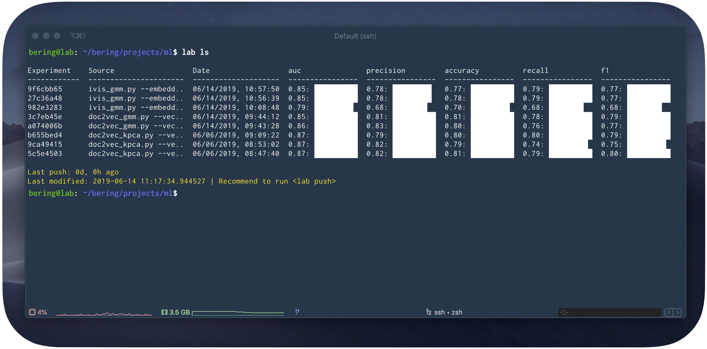

Machine Learning Lab
====================

Lab is an open source platform for managing machine learning pipelines. It addresses three core concepts: **Reproducibility**, **Logging**, and **Model Persistence**. Lab is lightweight and was designed to easily integrate with your existing training scripts.

.. warning::

    Lab is in active development and the current version of Lab is a beta release. This means that APIs and storage formats are subject to breaking change.

.. toctree::
  :maxdepth: 1
  :caption: User Guide:

  Quickstart <quickstart>
  Core concepts <concepts>
  Command Line Interface <cli>
  Tracking API <logging>

.. toctree::
  :maxdepth: 1
  :caption: Functionality:
 
  Managing Deep Learning Experiment <dlexperiments>
  Working with Jupyter Notebooks <notebook>
  Model repository <push>
  FAQ <faq>

.. toctree::
  :maxdepth: 1
  :caption: Applications:
  
  Examples <auto_examples/index>
