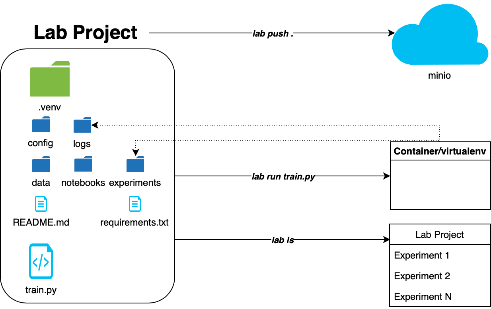

.. _push:

Model Repository
================

Lab uses minio to store Projects. `Minio <https://minio.io>`_ is a high performance distributed object storage server, designed for large-scale private cloud infrastructure. This makes it a great fit as a storage environment for multiple Lab Projects and Experiments. Lab makes it trivial to back up completed Projects and share them across teams.

Configuring minio server
------------------------

There are a number of ways to `install minio <https://docs.minio.io>`_ on a wide range of operating systems. See more details installation
instructions in minio documentation pages.

Setting up Lab minio interface
------------------------------

Once minio is up and running, you will need to make a note of the ``endpoint``, ``access key``, and ``secret key``. Lab supports multiple minio configurations
through a convenient tagging system. Each configuration can be set up through CLI:

.. code-block:: bash

    lab config minio --tag [MINIO_TAG] -- endpoint [TEXT] --accesskey [TEXT] --secretkey [TEXT]

Note that the endpoint is simply an IP address and port of a minio host, e.g. ``192.168.1.50:9000``.

Storing Lab Projects
--------------------

Lab Projects can be pushed to a specific minio host by running a simple command from the Project root folder:

.. code-block:: bash

  lab push --tag [MINIO_TAG] --bucket [TEXT] .

Here, ``--tag`` specifies a nickname of an exisiting minio connection and ``--bucket`` refers to a unique destination name on minio host, analogous to an S3 bucket.

Pruning remote repository
-------------------------

Sometimes it may be desirable to prune a remote repository. Pruning simply replaces the entire content of a remote repository with local files.
The user is warned just before proceding, as this operation can have undersirable consequences.

.. code-block:: bash

    lab push --tag [MINIO_TAG] --bucket [TEXT] --force .

Pulling from a remote repository
--------------------------------

To retrieve a Lab Project from a minio host, run a simple command from folder into which you'd like to pull the Project:

.. code-block:: bash

  lab pull --tag [MINIO_TAG] --bucket [TEXT] --project [TEXT].

In cases where connection with minio has already been establish, a project can be pushed/pulled directly from the project directory via ``lab push`` or ``lab pull`` without further options.
